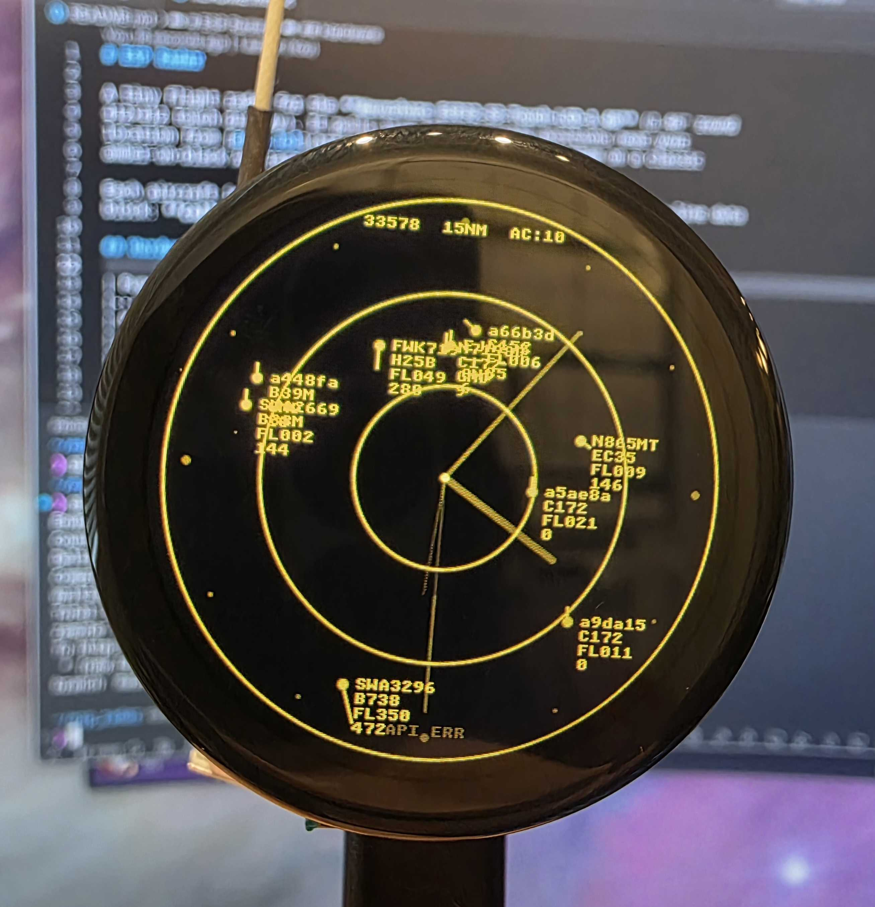

# ESP Radar

A tiny flight radar for the **Waveshare ESP32-S3-Touch-LCD-1.46** (1.46" round
412×412 touch display). It pulls live ADS-B aircraft positions near your
location from [adsb.lol](https://api.adsb.lol) and plots them on a classic
amber-on-black ATC radar scope. It doubles as a desk clock — a dim amber analog
clock is drawn behind the scope (see [Clock](#clock)).



Each aircraft is drawn as a dot with a velocity leader line and a four-line data
block: **callsign / type / flight level / ground speed**.

## Hardware

Buy the board: [Amazon](https://www.amazon.com/dp/B0DRJHQYKJ) · [Waveshare](https://www.waveshare.com/esp32-s3-touch-lcd-1.46b.htm)

| Function        | Detail                                                |
|-----------------|-------------------------------------------------------|
| MCU             | ESP32-S3 (16 MB flash, 8 MB octal PSRAM)              |
| Display         | SPD2010, 412×412 round, QSPI (SPI2)                   |
| Touch           | SPD2010 capacitive, I²C @ 0x53                         |
| I/O expander    | TCA9554 @ 0x20 (display + touch reset lines)          |
| Shared I²C bus  | SDA = GPIO11, SCL = GPIO10                             |
| Backlight       | GPIO5 (LEDC PWM)                                       |

## Project layout

```
esp_radar/
├── CMakeLists.txt              # top-level project
├── partitions.csv             # nvs + 4 MB factory app
├── sdkconfig.defaults         # PSRAM, 16 MB flash, TLS bundle, LVGL fonts
├── main/
│   ├── main.c                 # boot flow + the polling task
│   ├── Kconfig.projbuild      # Wi-Fi / location / radar settings
│   └── idf_component.yml      # managed component dependencies
└── components/
    ├── board/                 # I²C, TCA9554, SPD2010 display + touch, LVGL port
    ├── wifi_sta/              # Wi-Fi station connect + auto-reconnect
    ├── flight_data/           # adsb.lol HTTPS client + JSON parsing
    ├── radar_ui/              # the LVGL radar scope + background analog clock
    ├── timesync/              # SNTP time, persisted to the RTC
    ├── rtc/                   # PCF85063 RTC (time fallback / persistence)
    ├── beeper/                # short tone on each update (PCM5101 I²S DAC)
    ├── battery/               # battery voltage via ADC1/GPIO8 (indicator)
    └── power/                 # power-hold latch (GPIO7) + long-press shutdown
```

## Configure

All settings live under **`ESP Radar Configuration`** in `menuconfig`:

```sh
idf.py menuconfig
```

- **Wi-Fi** — SSID, password, max connection retries.
- **Location** — your latitude/longitude (decimal degrees) and a ZIP label
  shown in the header. The query uses the lat/lon directly.
- **Radar** — range / query radius in nautical miles (5–250) and the refresh
  interval in seconds.
- **Display** — toggle individual scope elements: background clock, range
  rings, battery indicator, header, status line, aircraft data blocks, and
  velocity leader lines.
- **Clock** — POSIX timezone and NTP server.

Defaults point at New York City (40.7128, -74.0060), 50 NM, 15 s, everything on.

## Flash from your browser (no toolchain)

Every release also publishes a **web flasher** to GitHub Pages:

> **<https://nurdism.github.io/esp_radar/>**

Open it in desktop **Chrome or Edge** (Web Serial), fill in your Wi-Fi,
location and other settings, plug the board in over USB, and click
**Connect & Flash**. The page writes the prebuilt firmware plus a tiny
`config` partition holding your settings — no ESP-IDF install required.

The location field accepts an **address** (geocoded via OpenStreetMap
Nominatim) or your **current location** (browser geolocation), with a toggle
to enter raw lat/lon instead. Every Display toggle above is exposed too.

How it works: settings live in a dedicated `config` flash partition (see
`partitions.csv`). At boot, [`app_config_load()`](components/app_config/app_config.c)
reads it and falls back to the compiled-in `menuconfig` defaults for any field
left blank. The browser builds that partition image client-side and flashes it
alongside the firmware, so values are injected **without recompiling**.

CI ([.github/workflows/release.yml](.github/workflows/release.yml)) builds the
firmware on every push, attaches the binaries to the GitHub Release on tags
(`v*`), and deploys the flasher to Pages. To cut a release:

```sh
git tag v1.0.0 && git push origin v1.0.0
```

> One-time repo setup: enable **Settings → Pages → Source: GitHub Actions**.

## Build, flash, monitor

This machine's ESP-IDF v5.5.4 is managed by `eim`; activate it with:

```sh
. ~/.espressif/tools/activate_idf_v5.5.4.sh
idf.py set-target esp32s3       # first time only
idf.py build
idf.py -p /dev/ttyACM0 flash monitor
```

## How it works

1. `board_init()` brings up I²C, resets and initialises the SPD2010 display and
   touch via the TCA9554, and starts the LVGL port (full-frame flush into PSRAM
   buffers, byte-swapped RGB565 for the QSPI panel).
2. `radar_ui_create()` draws the range rings and centre mark.
3. `wifi_sta_start()` connects in the background and reports state to the header.
4. A task polls `flight_data_fetch()` every refresh interval, projecting each
   aircraft onto the scope with an equirectangular bearing/distance calculation
   relative to home, and redraws via `radar_ui_update()`. A short beep plays
   after each successful refresh (PCM5101 DAC; toggle in menuconfig).

### Clock

A dim amber **analog clock** (hour/minute/second hands + 12 hour pips) is drawn
behind the scope. Time comes from two sources:

- **RTC (PCF85063)** — read at boot to seed the system clock immediately, so the
  clock is correct even before Wi-Fi connects or while offline.
- **SNTP** — started as soon as the network is up; it refines the time within a
  second and writes the result back to the RTC for next boot.

Set your zone with the POSIX **`ESP_RADAR_TZ`** string in menuconfig.

## Units

Nautical / aviation: range in NM, altitude as flight level (FLxxx), speed in
knots.

## License

[MIT](LICENSE)
